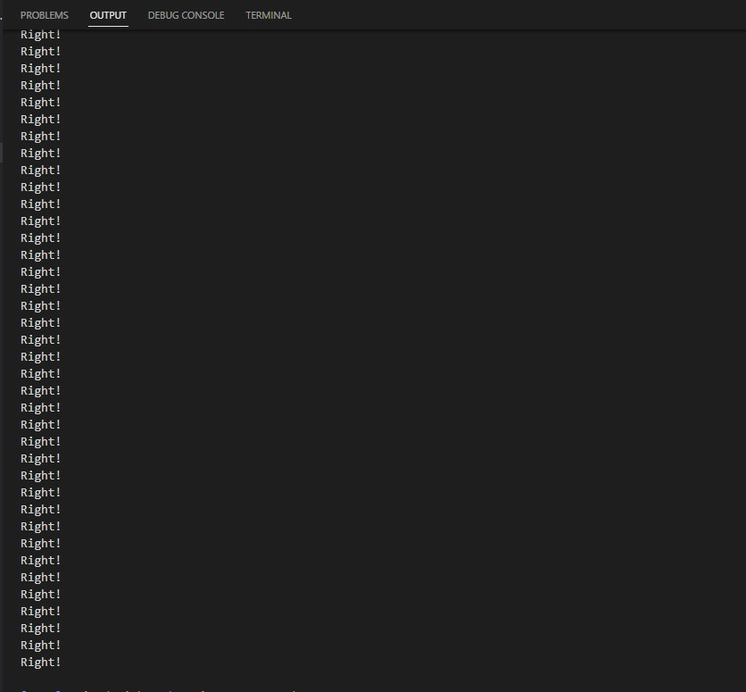
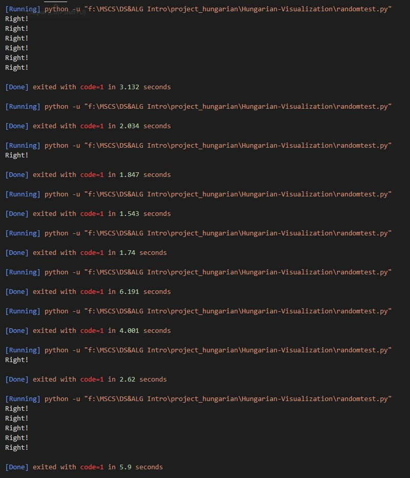

# Hungarian Algorithm Visuallization
## Package Requirement
version (not required to be the same)
```
python>=3.7
numpy>=1.23.1
streamlit>=1.15.0
pandas>=1.4.3
```
install
```
pip install numpy 
pip install pandas
pip install streamlit
```
## How to run
open this project directory in command line
```
streamlit run .\hungarian_test.py
```
## How to test
run `randomtest.py`
## Problems
N4solution is totally fine, you can see my result:

N3solution can return right result, but have problem when we use loop to test it. I'm not sure reason.


Good thing is we already have the optimized version of N3, we don't need any more N3 solutions if we fail to fix it.

## To Do
- [ ] compare performance with $n^3$ implementation and $n^4$ implementation
- [x] implement the $n^3$ implementation
- [x] compare the result with scipy's implementation, ensure that the code is bug-free
- [ ] add more complex visualization support
- [ ] add n3Graph implementation random test